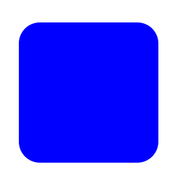
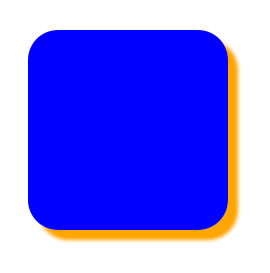
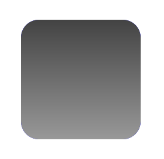
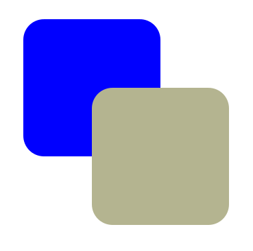
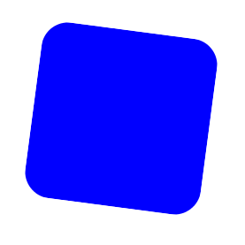
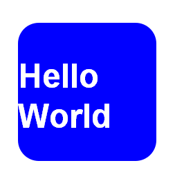

# CSS3常用功能的写法

随着浏览器的升级，CSS3已经可以投入实际应用了。

但是，不同的浏览器有不同的CSS3实现，兼容性是一个大问题。上周的YDN介绍了CSS3 Please网站，该网站总结了一些常用功能的写法。

以下就是这些写法的详细介绍。所有代码都经过了Firefox 3.6和IE 8.0的验证，原文的错误之处也已得到改正。


## 圆角（Rounded Corner）



```css
.box_round {
　　-moz-border-radius: 30px; /* FF1+ */
　　-webkit-border-radius: 30px; /* Saf3+, Chrome */
　　border-radius: 30px; /* Opera 10.5, IE 9 */
}
```

::: warning 注意
圆角的实现比较简单，只要设好一个半径值就可以了。遗憾的是，目前所有的IE都不支持CSS圆角，要等到IE 9才行。
:::


## 盒状阴影（Box Shadow）



```css
.box_shadow {
　　-moz-box-shadow: 3px 3px 4px #ffffff; /* FF3.5+ */
　　-webkit-box-shadow: 3px 3px 4px #ffffff; /* Saf3.0+, Chrome */
　　box-shadow: 3px 3px 4px #ffffff; /* Opera 10.5, IE 9.0 */
　　filter: progid:DXImageTransform.Microsoft.dropshadow(OffX=3px, OffY=3px, Color='#ffffff'); /* IE6,IE7 */
　　-ms-filter: "progid:DXImageTransform.Microsoft.dropshadow(OffX=3px, OffY=3px, Color='#ffffff')"; /* IE8 */
}
```

::: warning 注意
`-moz-box-shadow`、`-webkit-box-shadow`和`box-shadow`的设置是一样的，都有4个参数，含义分别为：x轴偏移值、y轴偏移值、阴影的模糊度、以及阴影颜色。

IE 6~8使用其独有的滤镜，需要设置三个参数：offX（X轴偏移值）、offY（Y轴偏移值）、Color（阴影颜色）。
:::


## 线性渐变（Gradient）



```css
.box_gradient {
　　background-image: -moz-linear-gradient(top, #444444, #999999); /* FF3.6 */
　　background-image: -webkit-gradient(linear,left top, left bottom, color-stop(0, #444444),color-stop(1, #999999)); /* Saf4+, Chrome */
　　filter: progid:DXImageTransform.Microsoft.gradient(startColorstr='#444444', endColorstr='#999999', GradientType='0'); /* IE6,IE7 */
　　-ms-filter: "progid:DXImageTransform.Microsoft.gradient(startColorstr='#444444', endColorstr='#999999',GradientType='0')"; /* IE8 */
}
```

先看Firefox。

```css
-moz-linear-gradient(top, #444444, #999999);
```

`-moz-linear-gradient`有三个参数。第一个参数表示线性渐变的方向，`top`是从上到下、`left`是从左到右，如果定义成`left top`，那就是从左上角到右下角。第二个和第三个参数分别是起点颜色和终点颜色。你还可以在它们之间插入更多的参数，表示多种颜色的渐变。

```css
-webkit-gradient(linear,left top, left bottom, color-stop(0, #444444),color-stop(1, #999999));
```

`-webkit-gradient`是webkit引擎对渐变的实现，一共有五个参数。第一个参数表示渐变类型（type），可以是`linear`（线性渐变）或者`radial`（辐射渐变）。第二个参数和第三个参数，都是一对值，分别表示渐变起点和终点。这对值可以用坐标形式表示，也可以用关键值表示，比如`left top`（左上角）和`left bottom`（左下角）。第四个和第五个参数，分别是两个`color-stop`函数。`color-stop`函数接受两个参数，第一个表示渐变的位置，0为起点，0.5为中点，1为结束点；第二个表示该点的颜色。

```css
DXImageTransform.Microsoft.gradient(startColorstr='#444444', endColorstr='#999999', GradientType='0');
```

IE依靠滤镜实现渐变。`startColorstr`表示起点的颜色，`endColorstr`表示终点颜色。`GradientType`表示渐变类型，0为缺省值，表示垂直渐变，1表示水平渐变。


## 透明（opacity）

正常情况下，上层的对象会覆盖下层的对象。



但是，如果将上层对象的颜色变为透明，就可以透过它看到下层对象。


```css
.box_rgba {
　　background-color: #B4B490;
　　background:transparent;
　　filter: progid:DXImageTransform.Microsoft.gradient(startColorstr='#99B4B490',endColorstr='#99B4B490'); /* IE6,IE7 */
　　-ms-filter: "progid:DXImageTransform.Microsoft.gradient(startColorstr='#99B4B490',endColorstr='#99B4B490')"; /* IE8 */
　　zoom: 1;
　　background-color: rgba(180, 180, 144, 0.6); /* FF3+, Saf3+, Opera 10.10+, Chrome */
}
```

先看第一行。

```css
background-color: #B4B490;
```

这是设置对象的预备色，也就是不透明时的颜色。如果浏览器不支持透明，就将显示这个颜色。

```css
background:transparent;
filter: progid:DXImageTransform.Microsoft.gradient(startColorstr='#99B4B490',endColorstr='#99B4B490'); /* IE6,IE7 */
-ms-filter: "progid:DXImageTransform.Microsoft.gradient(startColorstr='#99B4B490',endColorstr='#99B4B490')"; /* IE8 */
zoom: 1;
```

这几行是专门为IE写的，其中主要用到 `DXImageTransform.Microsoft.gradient`滤镜。我们要为它设置起点色（startColorstr）和终点色（endColorstr）。在单色透明的情况下，这两个值是相同的。需要注意的是，它们的取值是一个八位的十六进制值，前两位表示alpha通道值，00表示完全透明，FF表示完全不透明；后六位则是这个颜色的RGB值。

```css
background-color: rgba(180, 180, 144, 0.6);
```

除了IE，其他浏览器几乎都支持rgba函数。它有四个参数，前三个为一种颜色的RGB值，第四个为透明度，这里设为0.6。

## 旋转（rotation）



```css
.box_rotate {
　　-moz-transform: rotate(7.5deg); /* FF3.5+ */
　　-o-transform: rotate(7.5deg); /* Opera 10.5 */
　　-webkit-transform: rotate(7.5deg); /* Saf3.1+, Chrome */
　　filter: progid:DXImageTransform.Microsoft.Matrix(M11=0.9914,M12=-0.1305,M21=0.1305,M22=0.9914,SizingMethod='auto expand');
　　-ms-filter: "progid:DXImageTransform.Microsoft.Matrix(M11=0.9914,M12=-0.1305,M21=0.1305,M22=0.9914,SizingMethod='auto expand')"; /* IE8 */
}
```

除了IE以外，其他浏览器都是用rotate函数，实现某个对象的旋转。比如rotate(7.5deg)就表示顺时针旋转7.5度（degree）。

IE则需要用到一个复杂的滤镜DXImageTransform.Microsoft.Matrix。它一共接受五个参数，前四个参数需要自行计算三角函数，然后分别写成M11 = cos(rotation),M12 = -sin(rotation),M21 = sin(rotation),M22 = cos(rotation)，其中的rotation表示旋转角度，如果顺时针旋转7.5度，则rotation就为7.5；第五个参数SizingMethod表示重绘方式，'auto expand'代表自动扩展到新的边界。

除了这个滤镜，IE还有一个稍微简单一点的滤镜DXImageTransform.Microsoft.BasicImage(rotation=x)。其中的x只能取值为1，2，3，0，分别表示顺时针选择90度、180度、270度和360度。

## 服务器端字体（font-face）

设计网页的时候，可能会用到某种特殊的字体。如果用户的机器中没有安装，文字只能以普通字体显示。



这时可以让用户的浏览器自行下载服务器端字体，然后就能呈现出设计者想要的效果。


```css
@font-face {
　　font-family: 'MyFont';
　　src: url('myfont.eot'); /* IE6+ */
　　src: local('myfont.ttf'),
　　url('myfont.woff') format('woff'), /* FF3.6 */
　　url('myfont.ttf') format('truetype'); /* FF3.5+, Saf3+,Chrome,Opera10+ */
}
```

第一行代码：

```css
font-family: 'MyFont';
```

表示为这种字体起一个名称，可以随意设置，我这里用的是MyFont。

```css
src: url('myfont.eot');
```

这一行表示字体位置，由于ie只支持服务器端的eot字体，所以这一行是ie专用的。

```css
src: local('myfont.ttf'),
　　url('myfont.woff') format('woff'),
　　url('myfont.ttf') format('truetype');
```

local()表示在本机（客户端）查找该字体，如果本机已经安装了，就不用下载了。url()表示字体在服务器上的位置，format()用来说明字体格式。Firefox 3.5支持TrueType和OpenType字体，Firefox 3.6又增加了WOFF字体。其他基于Webkit引擎的浏览器（sarif，opera、chrome），目前好像只支持truetype。
然后，使用的时候这样写就可以了。

```css
h2{ font-family: "MyFont"; }
```

需要注意的是，字体文件必须与网页文件来自同一个域名，符合浏览器的"同源政策"。另外，由于中文字体文件太大，服务器端字体显然只适用于英文字体。

## 其他

利用css3，还可以完成transform（变形），包括skew（扭曲）和scale（缩放），以及css transitions（动态变换）。这些内容待以后再补充。