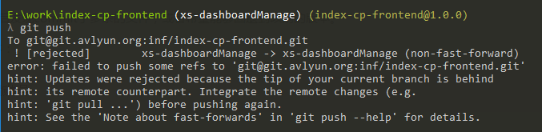

# git

## git常用

### 初始化
```bash
# 1. 创建git配置:  
$ git init
# 2. 把当前所有文件加入到本地git库:  
$ git add .
# 3. 确认加入文件到本地git库:  
$ git commit -m '写一些注释'
# 4. 把本地项目与远程git库关联:  
$ git remote add origin git@github.com:seYaO/XXX.git
# 5. 提交本地库中的文件到远程git库中:  
$ git push -u origin master
```
### 配置Git
```bash
# 1. 本地创建ssh key
$ ssh-keygen -t rsa -C "email"
# 目录下生成.ssh文件夹，打开id_rsa.pub，复制key，github中设置SSH Keys
# 2. 验证是否成功
$ ssh -T git@github.com
# 3. 设置username 和 email
$ git config --global user.name "your name"
$ git config --global user.email "your email"
```
### 创建项目的过程
```bash
$ makdir ~/demo    # 创建一个项目demo
$ cd ~/demo    # 打开这个项目
$ git init    # 初始化
$ touch README
$ git add README    # 更新README文件 （分享文件夹里所有代码，add 后面加 "."）
$ git commit -m "Test"    # 提交更新，并注释信息"Test"
$ git remote add origin git@github.com:xxx/xxx.git    # 连接远程github项目
$ git push -u origin master    # 将本地项目更新到github项目上去
$ git pull origin master    # 把远程服务器github上面的文件拉下来
```


## git命令

```bash
# 克隆
$ git clone git@github.com:seYaO/XXX.git

# 拉取
$ git pull

# 合并
git merge 其他分支 （到当前分支）

# 克隆指定分支
$ git clone -b v2.8.1 git@github.com:seYaO/XXX.git

# 创建本地分支
$ git checkout -b <branchName>

# 删除本地分支 （需要切换到其他分支进行操作）
$ git branch -d <branchName>

# 删除远程分支
$ git push origin --delete <branchName>

# 查看远程分支
$ git branch -r

# 拉取远程分支并创建本地分支
$ git checkout -b 本地分支名 origin/远程分支名
# 或
$ git fetch origin 远程分支名:本地分支名

# git中本地与远程库的关联与取消
$ git remote add origin git@github.com:seYaO/XXX.git (在本地目录下关联远程repository)
$ git remote remove origin (取消本地目录下关联的远程库)
```

## 撤销远端的commit

在使用git时，push到远端后发现commit了多余的文件，或者希望能够回退到以前的版本。

先在本地回退到相应的版本：
```bash
$ git reset --hard <版本号>
# // 注意使用 --hard 参数会抛弃当前工作区的修改
# // 使用 --soft 参数的话会回退到之前的版本，但是保留当前工作区的修改，可以重新提交
```

如果此时使用命令：
```bash
$ git push origin <分支名>
```

会提示本地的版本落后于远端的版本；


为了覆盖掉远端的版本信息，使远端的仓库也回退到相应的版本，需要加上参数`--force`
```bash
$ git push origin <分支名> --force
```

## git tag命令
```bash
# 查看所有的tag
$ git tag

# 创建带注释的标签
$ git tag -a <branchName> -m '注释内容'

# 上传tag
$ git push origin <branchName>

# 上传所有tag
$ git push origin --tags

# 删除本地tag
$ git tag -d <branchName>

# 删除远程tag
$ git push origin --delete tag <branchName>
```

## 常用 Git 命令清单

::: tip 提示
- Workspace：工作区
- Index / Stage：暂存区
- Repository：仓库区（或本地仓库）
- Remote：远程仓库
:::

### 一、新建代码库
```bash
# 在当前目录新建一个Git代码库
$ git init
# 新建一个目录，将其初始化为Git代码库
$ git init [project-name]
# 下载一个项目和它的整个代码历史
$ git clone [url]
```

### 二、配置
Git的设置文件为.gitconfig，它可以在用户主目录下（全局配置），也可以在项目目录下（项目配置）。
```bash
# 显示当前的Git配置
$ git config --list
# 编辑Git配置文件
$ git config -e [--global]
# 设置提交代码时的用户信息
$ git config [--global] user.name "[name]"
$ git config [--global] user.email "[email address]"
```
### 三、增加/删除文件
```bash
# 添加指定文件到暂存区
$ git add [file1] [file2] ...
# 添加指定目录到暂存区，包括子目录
$ git add [dir]
# 添加当前目录的所有文件到暂存区
$ git add .
# 添加每个变化前，都会要求确认
# 对于同一个文件的多处变化，可以实现分次提交
$ git add -p
# 删除工作区文件，并且将这次删除放入暂存区
$ git rm [file1] [file2] ...
# 停止追踪指定文件，但该文件会保留在工作区
$ git rm --cached [file]
# 改名文件，并且将这个改名放入暂存区
$ git mv [file-original] [file-renamed]
```
### 四、代码提交
```bash
# 提交暂存区到仓库区
$ git commit -m [message]
# 提交暂存区的指定文件到仓库区
$ git commit [file1] [file2] ... -m [message]
# 提交工作区自上次commit之后的变化，直接到仓库区
$ git commit -a
# 提交时显示所有diff信息
$ git commit -v
# 使用一次新的commit，替代上一次提交
# 如果代码没有任何新变化，则用来改写上一次commit的提交信息
$ git commit --amend -m [message]
# 重做上一次commit，并包括指定文件的新变化
$ git commit --amend [file1] [file2] ...
```
### 五、分支
```bash
# 列出所有本地分支
$ git branch
# 列出所有远程分支
$ git branch -r
# 列出所有本地分支和远程分支
$ git branch -a
# 新建一个分支，但依然停留在当前分支
$ git branch [branch-name]
# 新建一个分支，并切换到该分支
$ git checkout -b [branch]
# 新建一个分支，指向指定commit
$ git branch [branch] [commit]
# 新建一个分支，与指定的远程分支建立追踪关系
$ git branch --track [branch] [remote-branch]
# 切换到指定分支，并更新工作区
$ git checkout [branch-name]
# 切换到上一个分支
$ git checkout -
# 建立追踪关系，在现有分支与指定的远程分支之间
$ git branch --set-upstream [branch] [remote-branch]
# 合并指定分支到当前分支
$ git merge [branch]
# 选择一个commit，合并进当前分支
$ git cherry-pick [commit]
# 删除分支
$ git branch -d [branch-name]
# 删除远程分支
$ git push origin --delete [branch-name]
$ git branch -dr [remote/branch]
```
### 六、标签
```bash
# 列出所有tag
$ git tag
# 新建一个tag在当前commit
$ git tag [tag]
# 新建一个tag在指定commit
$ git tag [tag] [commit]
# 删除本地tag
$ git tag -d [tag]
# 删除远程tag
$ git push origin :refs/tags/[tagName]
# 查看tag信息
$ git show [tag]
# 提交指定tag
$ git push [remote] [tag]
# 提交所有tag
$ git push [remote] --tags
# 新建一个分支，指向某个tag
$ git checkout -b [branch] [tag]
```
### 七、查看信息
```bash
# 显示有变更的文件
$ git status
# 显示当前分支的版本历史
$ git log
# 显示commit历史，以及每次commit发生变更的文件
$ git log --stat
# 搜索提交历史，根据关键词
$ git log -S [keyword]
# 显示某个commit之后的所有变动，每个commit占据一行
$ git log [tag] HEAD --pretty=format:%s
# 显示某个commit之后的所有变动，其"提交说明"必须符合搜索条件
$ git log [tag] HEAD --grep feature
# 显示某个文件的版本历史，包括文件改名
$ git log --follow [file]
$ git whatchanged [file]
# 显示指定文件相关的每一次diff
$ git log -p [file]
# 显示过去5次提交
$ git log -5 --pretty --oneline
# 显示所有提交过的用户，按提交次数排序
$ git shortlog -sn
# 显示指定文件是什么人在什么时间修改过
$ git blame [file]
# 显示暂存区和工作区的差异
$ git diff
# 显示暂存区和上一个commit的差异
$ git diff --cached [file]
# 显示工作区与当前分支最新commit之间的差异
$ git diff HEAD
# 显示两次提交之间的差异
$ git diff [first-branch]...[second-branch]
# 显示今天你写了多少行代码
$ git diff --shortstat "@{0 day ago}"
# 显示某次提交的元数据和内容变化
$ git show [commit]
# 显示某次提交发生变化的文件
$ git show --name-only [commit]
# 显示某次提交时，某个文件的内容
$ git show [commit]:[filename]
# 显示当前分支的最近几次提交
$ git reflog
```
### 八、远程同步
```bash
# 下载远程仓库的所有变动
$ git fetch [remote]
# 显示所有远程仓库
$ git remote -v
# 显示某个远程仓库的信息
$ git remote show [remote]
# 增加一个新的远程仓库，并命名
$ git remote add [shortname] [url]
# 取回远程仓库的变化，并与本地分支合并
$ git pull [remote] [branch]
# 上传本地指定分支到远程仓库
$ git push [remote] [branch]
# 强行推送当前分支到远程仓库，即使有冲突
$ git push [remote] --force
# 推送所有分支到远程仓库
$ git push [remote] --all
```
### 九、撤销
```bash
# 恢复暂存区的指定文件到工作区
$ git checkout [file]
# 恢复某个commit的指定文件到暂存区和工作区
$ git checkout [commit] [file]
# 恢复暂存区的所有文件到工作区
$ git checkout .
# 重置暂存区的指定文件，与上一次commit保持一致，但工作区不变
$ git reset [file]
# 重置暂存区与工作区，与上一次commit保持一致
$ git reset --hard
# 重置当前分支的指针为指定commit，同时重置暂存区，但工作区不变
$ git reset [commit]
# 重置当前分支的HEAD为指定commit，同时重置暂存区和工作区，与指定commit一致
$ git reset --hard [commit]
# 重置当前HEAD为指定commit，但保持暂存区和工作区不变
$ git reset --keep [commit]
# 新建一个commit，用来撤销指定commit
# 后者的所有变化都将被前者抵消，并且应用到当前分支
$ git revert [commit]
# 暂时将未提交的变化移除，稍后再移入
$ git stash
$ git stash pop
```
### 十、其他
```bash
# 生成一个可供发布的压缩包
$ git archive
```


## .gitignore
#### 配置语法
- 以斜杠“/”开头表示目录；
- 以星号“*”通配多个字符；
- 以问号“?”通配单个字符；
- 以方括号“[]”包含单个字符的匹配列表；
- 以叹号“!”表示不忽略(跟踪)匹配到的文件或目录；
    
 此外，git 对于 .ignore 配置文件是按行从上到下进行规则匹配的，意味着如果前面的规则匹配的范围更大，则后面的规则将不会生效；

```bash
fd1/*
# 说明：忽略目录 fd1 下的全部内容；注意，不管是根目录下的 /fd1/ 目录，还是某个子目录 /child/fd1/ 目录，都会被忽略；

/fd1/*
# 说明：忽略根目录下的 /fd1/ 目录的全部内容；

/*
!.gitignore
!/fw/bin/
!/fw/sf/
# 说明：忽略全部内容，但是不忽略 .gitignore 文件、根目录下的 /fw/bin/ 和 /fw/sf/ 目录； 
```

## 问题和解决方案
```
输入 $ git remote add origin git@github.com:xxx/xxx.git
提示 fatal: remote origin already exists
// 解决方案：
先输入 $ git remote rm origin
再输入 $ git remote add origin git@github.com:xxx/xxx.git
就不报错了
---
如果输入 $ git remote rm origin 还是报错
提示 error: Could not remove config section 'remote.origin'
我们需要修改gitconfig文件的内容
找到你的github的安装路径，C:\Users\ASUS\AppData\Local\GitHub\PortableGit_ca477551eeb4aea0e4ae9fcd3358bd96720bb5c8\etc
找到你的github的安装路径，打开它把里面的[remote "origin"]那一行删掉就好
```
```
输入 $ ssh -T git@github.com
提示 Permission denied (publickey)
因为新生成的key不能加入 ssh 就会导致连接不上 github
// 解决方案
先输入 $ ssh-agent，再输入 $ ssh-add ~/.ssh/id_key，这样就可以了
---
如果输入 ssh-add ~/.ssh/id_key 还是报错
提示 error: Could not open a connection to your authentication agent.
// 解决方案
key 用 Git GUI 的 ssh 工具生成，这样生成的时候 key 就直接保存在 ssh 中了，不需要再 ssh-add 命令加入了，其它的 user，token 等配置都用命令行来做
---
最好检查一下在你复制 id_rsa.pub 文件的内容时有没有产生多余的空格或空行，有些编辑器会帮你添加这些的 
```
```
输入 $ git push origin master
提示 error: failed to push som refs to ......
// 解决方案
先输入 $ git pull origin master   //先把远程服务器github上面的文件拉下来
再输入 $ git push origin master
如果出现报错 fatal: Couldn't find remote ref master 或者 fatal: 'origin' does not appear to be a git repository 以及 fatal: Could not read from remote repository
则需要重新输入 $ git remote add origin git@github.com:xxx/xxx.git
```

## 参考链接
- [Git 使用规范流程](http://www.ruanyifeng.com/blog/2015/08/git-use-process.html)
- [Git远程操作详解](http://www.ruanyifeng.com/blog/2014/06/git_remote.html)
- [Git 工作流程](http://www.ruanyifeng.com/blog/2015/12/git-workflow.html)
- [本地项目上传到github](http://blog.csdn.net/henryrao1221/article/details/41554371)
- [Git Community Book 中文版](http://gitbook.liuhui998.com/index.html)
- [github 导入 gitbook](http://www.jianshu.com/p/fa38ef97431d)
